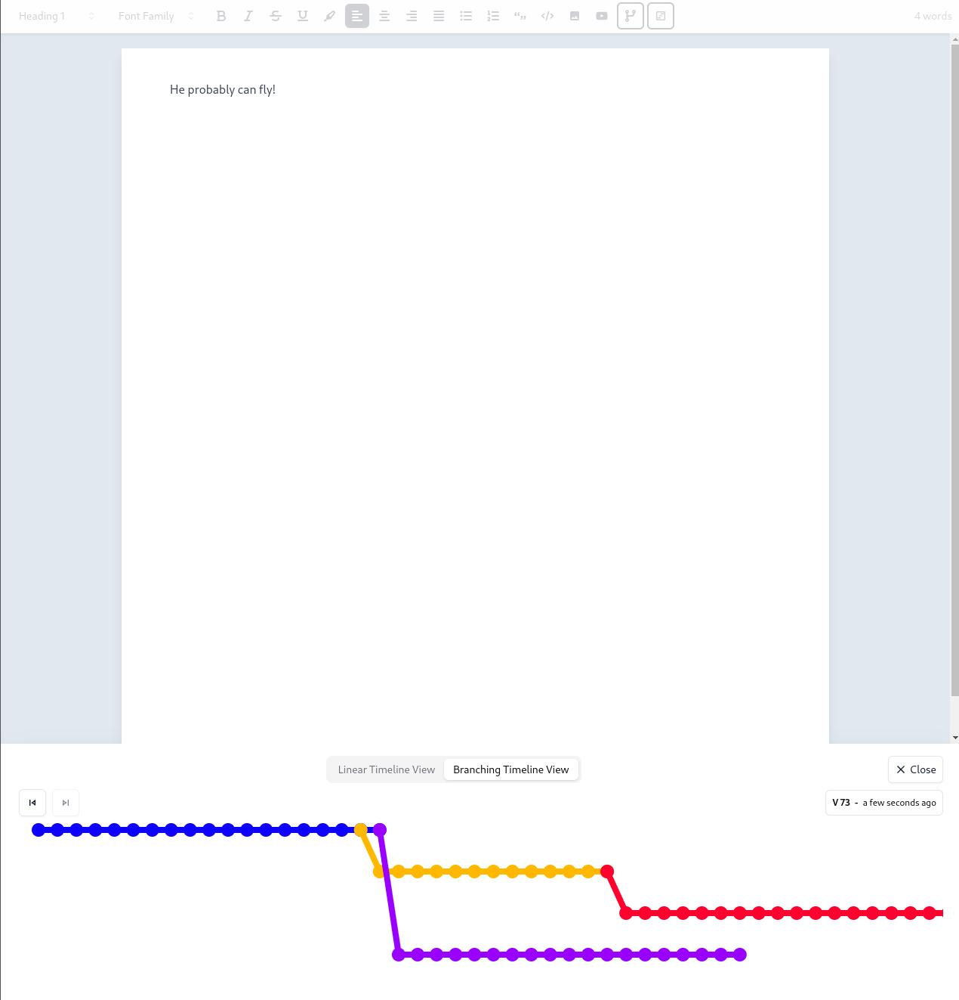

# Microsoft Word with Git versioning

### Demo

[Watch Demo Here](https://drive.google.com/file/d/1plA_kP4EHTaSRxLcp9X-XcpDNskOsVio/view?usp=drive_link)

### Screenshots

### Setup instructions

1. Unzip the archive
2. Go to the folder
3. Run `yarn`
4. Run `yarn dev`
5. Go to: [localhost:5173](http://localhost:5173/)

#### General Q&A

1. **Question:** Why I didn't use `useCallback` for some functions?
   **Answer:** `editor` variable will change on each change and everything will be rerendered again. `useCallback` and `useMemo` will be called every single time.

2. **Question:** Why not include `branchId` in each commit object or `commits` array in each branch object?
   **Answer:** Branches are just movable pointers to latest commits. Commits don't relate to any branch. A branch stores reference to starting point and to the last commit in it. Commits also store reference to the previous/parent commit. At least, that's how it's done in Git. A commit can be included in multiple branches and when a branch gets deleted, that doesn't mean commits are also deleted. Git uses **garbage collection** method to delete those commits after 30 days.

3. **Question:** Why didn't I split some `utils/constants/types` to separate files?
   **Answer:** Because everything is about this `Editor` component and every file would have 1 or 2 `utils/constants/types` in it. If the app was bigger and there were more components like: `<Sidebar />`, `<Dashboard />`, `<DocumentsList />`, `<SettinsPage />`, etc..., it'd definitely make sense to split `utils/constants/types` to more files.

4. **Question:** Why use `concat` instead of `...previousArray`
   **Answer:** Because performance wise `concat` is better.

5. **Question:** Why used React Context for passing props down?
   **Answer:** Because otherwise I had to pass props down 1 by 1 from `<Editor />` component down to the `<VersionBadge />` component

6. **Question:** Why didn't I create a reusable `<IconButton />` for each menu item?
   **Answer:** Properties would still be the same. Still need to pass name of the node/mark for editor's `isActive` method to check (right now it's `variant` property). Still need difference `tooltip` for each of them. Still need to pass a function for what happens `onClick`.

7. **Question:** Why didn't I create a reusable `<Select />` for fonts and headings?
   **Answer:** Because for same reason as `<Button />`. Both (fonts and headings) are too different. The only thing common between them is `className` property for `<SelectTrigger />`.
